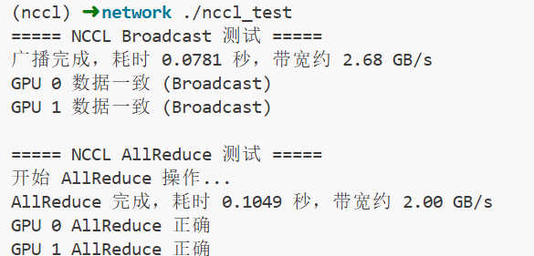
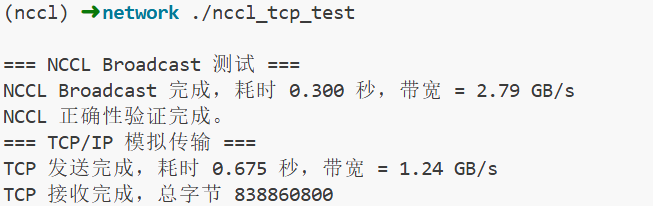

# 修改文件

# 测试方式
## 定制化 tcpdump 抓包：
编译tcpdump文件: `gcc -o tcpdump tcpdump.c -lpcap`

运行tcpdump: `sudo ./tcpdump eth0 "tcp port 80"`
其中第一个参数是要监听的网络接口名，第二个参数是抓包的过滤表达式

另开一个终端发送包: `curl https://example.com`

## 
只需在内核运行socket_test

# 7.2
安装nccl 
sudo apt install libnccl2 libnccl-dev

编译
nvcc nccl_test.c -o nccl_test \
  -I/usr/local/cuda/include \
  -I/usr/local/nccl/include \
  -L/usr/local/cuda/lib64 \
  -L/usr/local/nccl/lib \
  -lnccl

nvcc -o nccl_tcp_test nccl_tcp_test.cu -lnccl

结果

